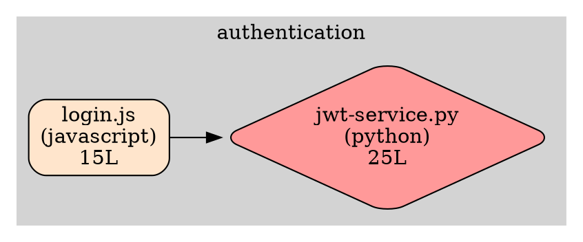

# Polyglot Dependency Graph Analyzer

Build a CLI tool that analyzes a polyglot codebase (Node.js, Python, Go) to generate dependency graphs with bounded context clustering.

## Overview

Create a Python script named `/workspace/analyzer.py` that:
1. Scans the repository at `/workspace/data/sample-repo/`
2. Identifies dependencies between modules
3. Calculates coupling metrics (fan-in, fan-out)
4. Groups modules by bounded contexts from `/workspace/data/contexts.json`
5. Generates two output files:
   - `/workspace/output/dependencies.dot` (Graphviz format)
   - `/workspace/output/report.md` (Markdown report)

## Step-by-Step Instructions

### Step 1: Create the Analyzer Script

Create a file at `/workspace/analyzer.py` that implements the dependency analysis logic.

### Step 2: Parse Multiple Languages

Your script must parse import statements from:

**JavaScript/TypeScript files (.js, .ts, .jsx, .tsx):**
```javascript
import { something } from './module';
const x = require('./module');
```

**Python files (.py):**
```python
import module
from module import something
```

**Go files (.go):**
```go
import "package"
import (
    "package1"
    "package2"
)
```

### Step 3: Calculate Metrics

For each module, calculate:
- **Lines of Code**: Count lines in the file
- **Fan-out**: Number of other modules this module imports
- **Fan-in**: Number of modules that import this module
- **Critical**: Flag as critical if `fan-in > 3` OR `fan-out > 5`

### Step 4: Apply Bounded Contexts

Read `/workspace/data/contexts.json` which contains:
```json
{
  "authentication": ["auth", "login", "jwt"],
  "payment": ["payment", "checkout", "stripe"],
  "inventory": ["inventory", "product", "stock"]
}
```

Assign each module to a context if its path contains any of the context's patterns.

### Step 5: Generate Graphviz .dot File

Output to: `/workspace/output/dependencies.dot`

**Required format:**


**Color codes:**
- Critical modules: `#FF9999` (red)
- API modules: `#FFE5CC` (light orange)
- Service modules: `#CCE5FF` (light blue)
- Data modules: `#E5CCFF` (light purple)
- Other: `#CCFFCC` (light green)

**Shape:**
- Critical modules: `diamond`
- Normal modules: `box`

### Step 6: Generate Markdown Report

Output to: `/workspace/output/report.md`

**Required sections:**

```markdown
# Dependency Analysis Report

**Analysis Date:** 2025-01-02T12:00:00
**Total Modules:** 6
**Total Dependencies:** 4

## Summary by Language

| Language | Modules | Lines of Code |
|----------|---------|---------------|
| javascript | 2 | 45 |
| python | 3 | 78 |
| go | 1 | 32 |

## Bounded Contexts

### authentication

Contains 2 modules:

- **src/auth/login.js** (javascript, api)
- **src/auth/jwt-service.py** (python, service) ⚠️ **CRITICAL**

### payment

Contains 2 modules:

- **src/payment/checkout.go** (go, service)
- **src/payment/stripe-api.js** (javascript, service)

### inventory

Contains 2 modules:

- **src/inventory/product.py** (python, data)
- **src/inventory/stock.go** (go, data)

## Critical Modules

| Module | Language | Type | Fan-in | Fan-out | Lines |
|--------|----------|------|--------|---------|-------|
| src/auth/jwt-service.py | python | service | 5 | 2 | 25 |

## Recommendations

- ⚠️ Module "src/auth/jwt-service.py" has high fan-in (5). Consider if it's doing too much.
- ✅ Good separation of concerns with low average fan-out.
```

## Implementation Tips

1. **Start simple**: First, just scan files and count lines
2. **Parse incrementally**: Add parsing for one language at a time
3. **Test as you go**: Print intermediate results to verify logic
4. **Use regular expressions**: For matching import statements
5. **Handle errors**: Files might not exist, parsing might fail

## Example Command Sequence

```bash
cd /workspace
python3 analyzer.py
ls -la output/
cat output/dependencies.dot
cat output/report.md
```

## Success Criteria

Your solution must:
1. ✅ Create `/workspace/output/dependencies.dot` with valid Graphviz syntax
2. ✅ Create `/workspace/output/report.md` with all required sections
3. ✅ Include at least 3 subgraph clusters in the .dot file
4. ✅ Correctly identify critical modules (fan-in > 3 OR fan-out > 5)
5. ✅ Parse all three languages (JavaScript, Python, Go)
6. ✅ Generate proper tables in Markdown
7. ✅ Show dependency edges between modules in .dot file

## Files Provided

- `/workspace/data/sample-repo/src/` - Source code to analyze
- `/workspace/data/contexts.json` - Bounded context definitions

## Expected Output Files

- `/workspace/output/dependencies.dot` - Graph visualization
- `/workspace/output/report.md` - Analysis report

## Debugging

If your script fails:
- Check file paths are absolute (start with `/workspace/`)
- Verify you can read from `/workspace/data/`
- Verify you can write to `/workspace/output/`
- Print debug information to see what's happening
- Test regex patterns with sample strings first